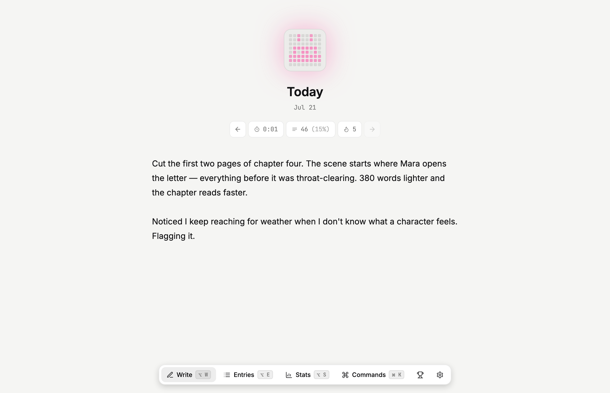

# Oscar

A minimal, keyboard-first daily writing journal. One entry per calendar
day, a plain-text editor with a typewriter feel, and an 8×8 pixel tile
that reacts to your writing — an equalizer while you type, celebration
glyphs when you hit a milestone. Everything is stored locally; your
writing never leaves your device unless you turn on sync — and when you
do, it leaves encrypted, with the key never going anywhere. Optional,
opt-in usage analytics (below) only ever count *that* you did something,
never *what* you wrote.

Built from a design handoff — an HTML prototype and a token/pattern
reference — as React + TypeScript + Vite, with plain CSS custom
properties and no component library.

<picture>
  <source media="(prefers-color-scheme: dark)" srcset="docs/oscar-dark.png">
  
</picture>

## Quick start

```bash
npm install
npm run dev            # http://localhost:5173
```

| Script            | What it does                                  |
| ----------------- | --------------------------------------------- |
| `npm run dev`     | Vite dev server with HMR                       |
| `npm run typecheck` | Type-check the app and the API                |
| `npm run build`   | Type-check then production build               |
| `npm run preview` | Serve the production build                      |
| `npm test`        | Run the unit tests once (Vitest)               |
| `npm run test:watch` | Watch mode                                  |
| `npm run test:e2e` | Playwright end-to-end specs                   |

Requires Node 18+.

### Handy URLs

- `?seed` — one-time demo data (six sample entries) if the journal is
  empty, e.g. `http://localhost:5173/?seed`. Nothing is seeded once you
  have real entries.
- `#tile-demo` — a standalone page that cycles every pixel-tile glyph,
  for working on the tile in isolation.

## The app

Six views, reachable from the floating toolbar or the keyboard:

- **Write** — the default. Borderless editor with an accent caret, a
  placeholder that greets you by name and types itself out, word-count
  milestones in the left margin, a typewriter scroll that keeps the
  caret near center, a session timer, day navigation, a "past day"
  banner, and an "on this day" card. The pixel tile lives up top.
- **Entries** — searchable list grouped by month and year.
- **Stats** — streak/total/entries/best-day tiles, a 28-day line chart,
  a 24-hour radial "writing hours" clock, weekday bars, a GitHub-style
  year heatmap (milestone days are colored by their glyph), a pace
  forecast, and vocabulary facts.
- **Milestones** — 20 achievements in 5 groups, earned dates in tooltips.
- **Settings** — name, daily goal, theme, focus mode, and all the data
  controls below.
- **Tile demo** — see `#tile-demo` above.

### Keyboard model

`⌘K` is the only ⌘ binding. Everything else lives on the `⌥` layer
(read via `e.code`, so the shortcuts work even while you're typing).

| Keys        | Action                    |
| ----------- | ------------------------- |
| `⌘K`        | Command palette           |
| `⌥W`        | Write / jump to today     |
| `⌥E`        | Entries                   |
| `⌥S`        | Stats                     |
| `⌥M`        | Milestones                |
| `⌥T`        | Settings                  |
| `⌥F`        | Toggle focus mode         |
| `⌥D`        | Toggle theme              |
| `←` / `→`   | Previous / next day (Write) |
| `⌥←` / `⌥→` | Back / forward a week     |
| `Esc`       | Unwind: palette → calendar → blur input → exit focus → back to Write |

The command palette also parses natural-language dates — "jun 12",
"12 jun 2025", "yesterday", "tuesday".

## Architecture

Plain React with a small hand-rolled store; no state library, no router
— view is a piece of `useState` in [`App.tsx`](src/App.tsx).

```
src/
├── App.tsx              View router, keyboard model, session tracking, footer
├── components/
│   ├── PixelTile.tsx    The 8×8 tile: equalizer + glyph stage
│   ├── glyphs.ts        Glyph bitmaps, colors, priorities, animation frames
│   ├── Toolbar.tsx      Floating nav with the sliding active indicator
│   ├── CalendarPopover.tsx / CommandPalette.tsx / Tooltip.tsx / Icons.tsx
│   └── useFocusTrap.ts     Focus trap + restore for modal surfaces
├── screens/            Write, Entries, Stats, Milestones, Settings, TileDemo
├── data/
│   ├── store.ts         Typed store over localStorage (subscribe/snapshot)
│   ├── dates.ts         Local-date day keys + DST-safe arithmetic
│   ├── selectors.ts     Word counts, streaks, totals, histograms, forecast
│   ├── milestones.ts    The 20 milestone definitions + earned dates
│   ├── crypto.ts        WebCrypto AES-GCM passcode gate
│   ├── backup.ts        JSON export/import with merge-on-import
│   └── useStore.ts      useSyncExternalStore binding
├── sync/
│   ├── merge.ts         Pure LWW-per-day merge with tombstones
│   ├── identity.ts      Master key → HKDF account/auth/enc; sync-key codec
│   ├── target.ts        SyncTarget interface + IndexedDB persistence
│   ├── fileTarget.ts    File System Access backend
│   ├── cloudTarget.ts   Zero-knowledge cloud backend
│   └── engine.ts        Orchestrator: pull → merge → apply → push
├── styles/             tokens.css (theme) + app.css (interaction states)
├── ../api/             Sync API (Vercel Edge Function + Upstash Redis)
├── ../e2e/             Playwright end-to-end specs
└── ../scripts/         smoke-sync.mjs — post-deploy API check
```

### Data & privacy

All data lives in `localStorage` under `daybook.*` keys (entries, times,
hours, per-day sync metadata, settings). Day keys are **local calendar
dates** (`YYYY-MM-DD`), and all date math is DST-safe — see the tests in
[`dates.test.ts`](src/data/dates.test.ts).

- **Backup** — export/import the whole journal as JSON. Import *merges*:
  missing days are filled, and on a conflict the longer text wins.
- **Passcode** — optionally encrypt entries at rest with AES-GCM (key
  derived from the passcode via PBKDF2). Set, change (re-keys and
  re-encrypts in place), or remove it in Settings; there's no recovery,
  so keep it safe.
- **Trash** — clear the current day with **Clear this day** in the ⌘K
  palette (a soft delete). Cleared days stay restorable in Settings for
  30 days, then expire on their own; you can also restore, delete, or
  empty the trash by hand. The sync tombstone lives separately in
  `dayMeta`, so purging the trash never resurrects a day elsewhere.
- **Storage meter** — Settings shows usage against the ~5 MB budget and
  warns before you hit it.
- **Usage analytics** — off by default and opt-in from Settings, over
  [Umami](https://umami.is) (privacy-first, cookieless). Enabled only when
  `VITE_UMAMI_SRC` and `VITE_UMAMI_WEBSITE_ID` are set at build time; even
  then, no tracker script loads until the user opts in and Do Not Track is
  off. What's sent is a small, typed allowlist of anonymous events — screen
  changes, that a writing session happened (with its word count/minutes),
  sync/passcode/export toggles — and **never** entry text, titles, search
  terms, or day keys. The whole layer lives in
  [`analytics.ts`](src/data/analytics.ts); if an event isn't in its union,
  it can't be sent.

### Sync (optional)

Local-first is the source of truth; sync just exchanges one document
through a backend. Two backends sit behind a shared
[`SyncTarget`](src/sync/target.ts) interface and the same merge core:

- **Cloud** (default, every browser) — a zero-knowledge
  [sync API](api/) that ships with the app as a Vercel Edge Function over
  Upstash Redis. Everything derives from one 256-bit **master sync key**,
  shown once as a copyable code (`oscar1-…`); the client derives an
  account id, a bearer token, and an AES-GCM key from it via HKDF. The
  server stores only ciphertext and a *hash* of the auth token, so it can
  never read your journal. Add a device by pasting the same key. API and
  app share an origin, so there's nothing to configure.
- **File** (Chromium only) — a JSON file **you own**, via the File System
  Access API; drop it in an iCloud/Dropbox/Drive folder for no-server
  sync. Encryption here is the optional local passcode.

Both share:

- Last-write-wins per day-key, with tombstones so deletions propagate
  instead of resurrecting.
- Offline-first: edits queue locally and push when the backend is
  reachable; remote changes are picked up by polling.
- Concurrent edits to the same day surface as conflicts in Settings, with
  the losing version preserved (never silently dropped). A push that
  races another device (version conflict) re-pulls and re-merges.

The merge and identity logic are pure and unit-tested
([`merge.test.ts`](src/sync/merge.test.ts),
[`identity.test.ts`](src/sync/identity.test.ts)); the API has its own
handler tests ([`api/handler.test.ts`](api/handler.test.ts)).

## Deploying

The app and its sync API deploy together to Vercel — see
[`DEPLOY.md`](DEPLOY.md) for the walkthrough. In short: import the repo,
add the Upstash Redis integration (which sets the storage env vars), and
deploy. Then verify the live API with:

```bash
node scripts/smoke-sync.mjs https://your-app.vercel.app
```

## Testing

```bash
npm test          # Vitest unit tests (node env)
npm run test:e2e  # Playwright E2E (boots the dev server itself)
```

**93 unit tests** cover the load-bearing logic: local-date/DST day keys,
streak and word-count selectors, backup merge, the passcode lifecycle
(set / change / unlock, re-keying at rest), the trash lifecycle (soft
delete / restore / purge / TTL expiry), the sync merge (LWW + tombstones
+ conflict detection), the zero-knowledge identity codec, and the sync
API request handler.

**Playwright** ([`e2e/`](e2e/)) drives the real UI in Chromium: writing
persists across a reload, the ⌥-layer shortcuts and toolbar move between
views, the command palette exposes accessible dialog/listbox roles and
jumps to a parsed date, clearing a day round-trips through the trash, and
a passcode locks then unlocks the journal.

Both suites run on every push and PR via
[GitHub Actions](.github/workflows/ci.yml) — typecheck, unit tests and
build in one job, Playwright in another (with the HTML report uploaded on
failure).
